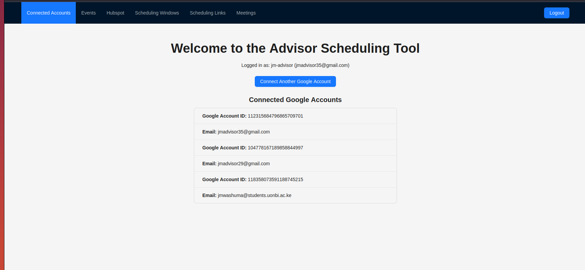

# Advisor Calendar Scheduling Tool

A Calendly-like scheduling tool for advisors to meet with their clients, featuring deep Google Calendar and Hubspot CRM integration, AI-powered meeting enrichment, and a modern, user-friendly interface.

---

## Features

1. **Login with Google & Calendar Integration**  
   Advisors log in with Google, and the app displays their primary Google Calendar events for instant availability management.

2. **Connect Multiple Google Accounts**  
   Advisors can connect multiple Google accounts, aggregating events from all calendars for accurate availability.

3. **Connect Hubspot CRM Account**  
   Secure OAuth integration with Hubspot CRM allows the app to access and enrich meetings with CRM contact data.

4. **Create Scheduling Windows**  
   Advisors define their general availability by creating flexible scheduling windows (e.g., multiple slots per day).

5. **Create Scheduling Links**  
   Advisors generate unique scheduling links with custom settings: usage limits, expiration dates, custom intake forms, meeting lengths, and advance scheduling limits.

6. **Client-Facing Scheduling Page**  
   Clients access a public, unauthenticated page to view available time slots (aggregated from all connected calendars) and book meetings.

7. **Custom Intake Forms for Clients**  
   Clients provide their email, LinkedIn, and answers to advisor-defined questions when booking.

8. **Advisor Notifications**  
   Advisors receive email notifications for new bookings, including all relevant meeting and client details.

9. **Hubspot Contact Matching & LinkedIn Scraping**  
   After booking, the app matches the client's email to Hubspot contacts or scrapes LinkedIn for context, optionally using AI for summarization.

10. **AI-Augmented Meeting Information**  
    Client answers are enriched with AI, combining Hubspot notes and LinkedIn data for deeper insights.

11. **View Meeting Details in the App**  
    Advisors can review all meeting details, client responses, and AI-augmented notes in the app.

## Tech Stack

- **Frontend:** React (Ant Design, dayjs, Redux, Redux Thunk, Redux Toolkit)
- **Backend:** FastAPI (Python, managed with [uv](https://github.com/astral-sh/uv) for package management and virtual environment setup if not using Docker Compose)
- **Database:** SQLite (default, can be swapped)
- **Containerization:** Docker, Docker Compose
- **Deployment:** Fly.io
- **Integrations:** Google Calendar (OAuth), Hubspot CRM (OAuth), LinkedIn (scraping), OpenAI/AI for summarization

---

## How It Works

- Advisors manage their availability and create custom scheduling links.
- Clients book meetings via public links, filling out custom forms.
- The app checks all connected calendars for conflicts, ensures compliance with advisor-defined rules, and enriches meeting data with CRM and LinkedIn context.
- Advisors are notified and can review all meeting details and AI-powered insights in the app.

---

## Development Setup

### Prerequisites

- Docker & Docker Compose installed
- Alternatively, [uv](https://github.com/astral-sh/uv) for Python package management and virtual environment setup if not using Docker Compose

### Quick Start

1. **Clone the repository:**
   ```bash
   git clone git@github.com:JohnMwashuma/calendar-scheduling-tool.git
   cd calendar-scheduling-tool
   ```

2. **Start both frontend and backend:**
   ```bash
   docker compose build --no-cache backend
   docker compose build --no-cache frontend
   docker compose up --force-recreate
   ```

   - Frontend: [http://localhost:3000](http://localhost:3000)
   - Backend API: [http://localhost:8000/api/](http://localhost:8000/api/)

---

## Environment Variables

### Frontend

| Variable                      | Description                                                                                   |
|-------------------------------|----------------------------------------------------------------------------------------------|
| `REACT_APP_API_BASE_URL`      | The base URL for the backend API. Used by the frontend to make API requests (e.g `http://localhost:8000/api/` for local dev).                 |
| `REACT_APP_FRONTEND_DOMAIN`   | The domain where the frontend is hosted (e.g., `localhost` for local dev).                   |

### Backend

| Variable                      | Description                                                                                   |
|-------------------------------|----------------------------------------------------------------------------------------------|
| `SECRET_KEY`                  | Secret key for cryptographic operations (sessions, tokens, etc.).                            |
| `ALLOWED_ORIGINS`             | Comma-separated list of allowed origins for CORS (e.g., `http://localhost:3000`).            |
| `GOOGLE_CLIENT_ID`            | OAuth client ID for Google integration (login and calendar access).                          |
| `GOOGLE_CLIENT_SECRET`        | OAuth client secret for Google integration.                                                  |
| `GOOGLE_REDIRECT_URI`        | OAuth client redirect uri for Google integration. (e.g., `http://localhost:8000/api/auth/google/callback`)                                                  |
| `HUBSPOT_CLIENT_ID`           | OAuth client ID for Hubspot CRM integration.                                                 |
| `HUBSPOT_CLIENT_SECRET`       | OAuth client secret for Hubspot CRM integration.                                             |
| `HUBSPOT_REDIRECT_URI`       | OAuth client redirect uri for Hubspot CRM integration. (e.g. `http://localhost:8000/api/hubspot/connect/callback`)                                             |
| `OPENAI_API_KEY`              | API key for OpenAI, used for AI-powered summarization and enrichment.                        |
| `SMTP_HOST`                  | SMTP server host for sending notification emails.                                            |
| `SMTP_PORT`                  | SMTP server port.                                                                            |
| `SMTP_USER`             | SMTP username for sending emails.                                                            |
| `SMTP_PASS`         | SMTP password for sending emails.                                                            |
| `EMAIL_FROM`                  | The email address that notification emails are sent from.                                    |

---

## Deployment

### Fly.io

1. **Install Fly CLI:**  
   https://fly.io/docs/hands-on/install-flyctl/

2. **Login and create your app:**
   ```bash
   fly launch
   ```

3. **Deploy backend and frontend separately:**
   - Each app (backend and frontend) is deployed independently.
   - For each deployment:
     1. `cd` into either the `backend` or `frontend` directory.
     2. Update the `.env` file (or set environment variables/secrets as required by your setup) with the correct values for that service.
     3. Run:
        ```bash
        fly deploy
        ```
   - Repeat the process for the other service (i.e., deploy both `backend` and `frontend` individually).

4. **Access your deployed app via the Fly.io dashboard on the provided URL.**

---

## Customization

- Adjust meeting lengths, scheduling windows, and more via the admin UI.
- For production, update environment variables and database settings as needed.

---

## Contributing

PRs and issues are welcome!

---
## Screenshots

### Landing Page


### Adivisors Connected Google Accounts


### Advisors Calendar Events


### Connected to Hubspot


### Hubspot CRM Screen


### Scheduling Windows


### Scheduling Links


### Public View with Schedules


### Booking A Meeting Page


### Booking A Meeting Form


### Advisors Meetings


### Meeting Content with Augmented Notes


### Meeting Email with Context from Hubspot Augmented by OpenAI
